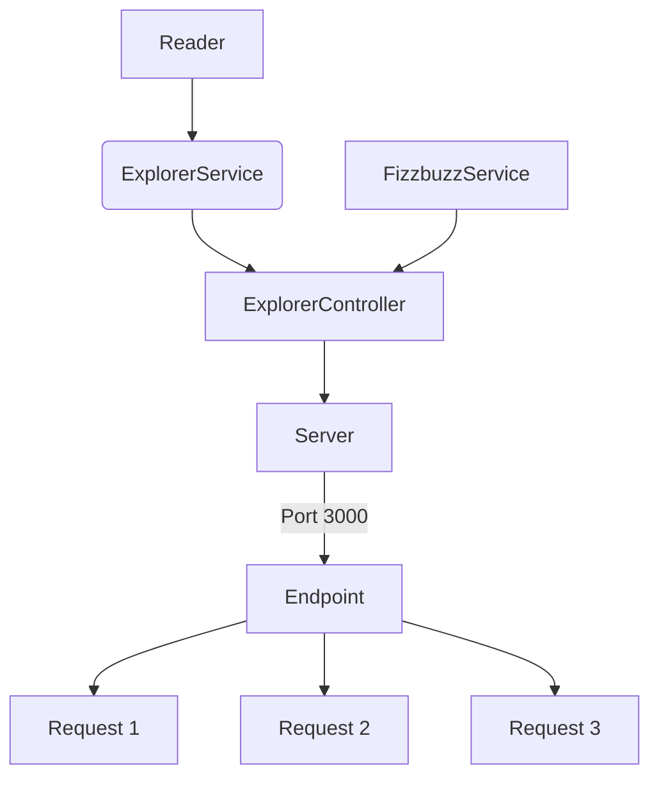
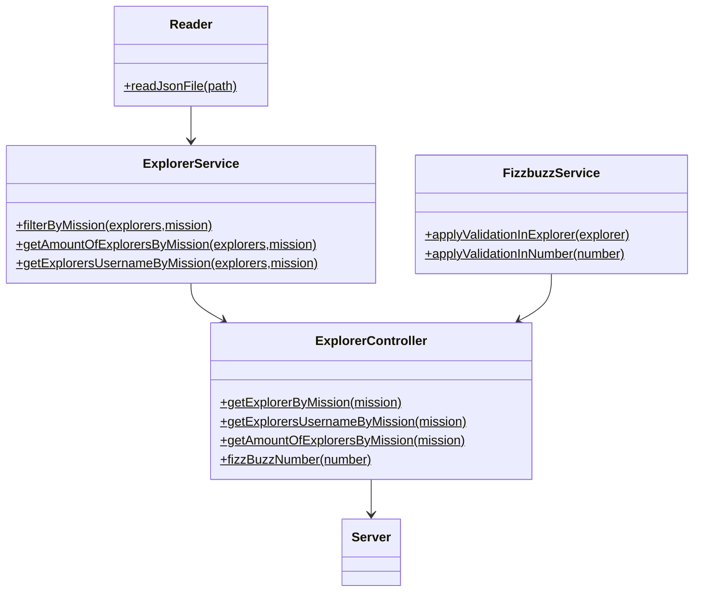

# Fizzbuzz proyect

Refactoring de una app legada en JS.
___
Modularización de clases y metodos con CommonJS y pruebas de unidad con jest.

## Requisitos

Nececitas tener`node` y`npm`. 
Revisar la [pagina de node](https://nodejs.org/es/download/) para ver el procedimiento dependiendo de tu SO.

___

## Diagramas

Funcionamiento del proyecto.

## Diseño de las clases
Estructura de las clases en el proyecto.

## Endpoints

| Endpoint | Request |
|---|---|
| `localhost:3000/v1/explorers/:mission/` | `localhost:3000/v1/explorers/node` | 
| `localhost:3000/v1/explorers/amount/:mission` | `localhost:3000/v1/explorers/amount/node` | 
| `localhost:3000/v1/explorers/usernames/:mission` | `localhost:3000/v1/explorers/usernames/node` | 
| `localhost:3000/v1/explorers/fizzbuzz/:score` | `localhost:3000/v1/explorers/fizzbuzz/3` | 

## Response

## Tecnologías

* JavaScript
* Jest
* Github Actions
* ESLint
* Express
* Postman
